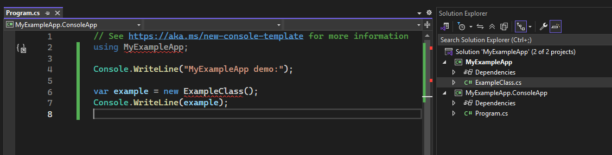
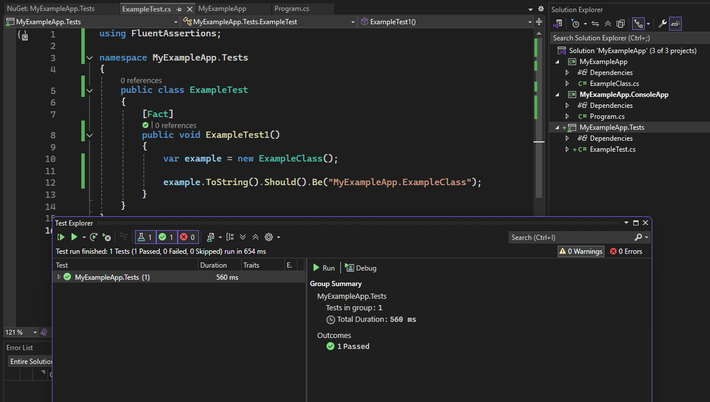

# Dev Environment & Project Setup

Each section contains a step-by-step guide for setting up your projects & troubleshooting common issues.

Click each heading to expand!

---

    
<b>A. Creating a new project</b>

- **File > New > Project**, or [Create a new project](./.images/A01_new-project.png) from the Visual Studio home screen.
- Let's start with a [new class library](./.images/A02_new-project.png), since we'll be defining a class first.
- Make sure you're [choosing the right directory](./.images/A03_new-project.png), and it's cleaner to **not** have project & solution metafiles in the same directory.
- We'll stay in [NET 9.0](./.images/A04_new-project.png) to get access to Blazor improvements.
- In the example, I've [renamed](./.images/A05_new-project.png) the default `Class1` to `ExampleClass`

---

    
<b>B. Opening an existing project</b>

- You can open a project/solution from the **File** menu or Visual Studio home screen, or even double-click an `.sln` file from a folder.
  -  do **not** [open folder](./.images/B01a_opening-and-modifying.png) instead of project/solution! If you get [folder view](./.images/B01b_opening-and-modifying.png), you can't build/run your project.
  - instead, make sure you see the [Solution View](./.images/B03_opening-and-modifying.png) 

---

    
<b>C. Multiple projects within one solution</b>

- Create a new project to add to the solution.
  - In my example, I've made my second one a [console app](./.images/C01_multiple-projects.png) so I can write a short program to run my class.
- Make sure to **[add your second project to the existing solution](./.images/C02_multiple-projects.png)** rather than creating a new one.
  - Be careful about folder placement; select the root directory of the *solution* so all *projects* end up next to each other.
- Now that I have my project, I wrote a little program.
  - Notice how the `MyExampleApp` namespace and `ExampleClass` class are red-underlined! 
  - The console app project doesn't know what those two things are yet... 
  - but it will if we add a reference to the first project (next step)!

  
- To add a reference, [right-click](./.images/C05_multiple-projects.png) *the project you want to add the reference* **to**, and select **Add > Project Reference**. 
  - It's a huge menu! **Add** is near the middle.
  - You **need** to hit the [checkbox](./.images/C06_multiple-projects.png) for all projects you want to add references for.
- And, [voila](./.images/C08_multiple-projects.png)!
- If you are **only** creating class libraries & tests, that's all you need to do.
- If you are **also** creating a program that will use/run your class libraries, you need to set it as the startup project:
  - [right click the program's project](./.images/C08_multiple-projects.png)  and **Set as Startup Project**.
  - The startup project's name will be **bolded**. Now you can build the project & run the program!
    - Why? The `dotnet` runtime is concerned with what it actually needs to *run* -- class libraries are definitions we write, not programs we run. 

  - OK, let's try running our application now. [Hell yea!](./.images/C08_multiple-projects.png)
- To make another project for **tests**, you would do the same steps as above; just change the project type to a C# `xUnit` project.
    - In this example, I called mine `MyExampleApp.Tests`.
    - You don't need to make a test project the startup project.
    - Don't forget to add your class library project(s) as references to your test project too!
    - To run the tests, **Tests > Run All Tests** from the top menu.

---

    
<b>D. Installing & Managing Packages</b>

**NOTE:** When you install a package, it is *only* specific to that project!

>Let's assume you've also made the `xUnit` test project (or are following along in my example, where I've made the test project `MyExampleApp.Tests`). 
>I've already added references from the `MyExampleApp` class library project.

- To manage package stuff, **Project > Manage NuGet Packages** from the top menu.
  - The **Manage NuGet Packages** option is near the bottom of the Project menu.
- Let's try installing `FluentAssertions`! Simply [type the name](./.images/D01_packages.png) of the package and hit install. 
    - If nothing comes up, you're probably in the `Installed` tab rather than the `Browse` tab.
    - Notice how [the package is only being added](./.images/D02_packages.png) to the `MyExampleApp.Tests` project. You can choose to not show this dialog box again; it's not important.
    - Now that the package is installed, we can use [`FluentAssertions` syntax](https://fluentassertions.com/introduction) in our tests!

---

    
<b>X. Troubleshooting</b>

- if your build fails, read the error messages carefully -- they will tell you exactly what's going wrong!
- to get a working build, you can either:
    - **Build > Rebuild Solution** (cleans-then-builds the solution's projects one at a time)
    - **Build > Clean Solution** followed by **Build > Build Solution** (cleans all, then builds all)
- if a lot of people encounter similar issues, I'll address more common troubleshooting cases here.

